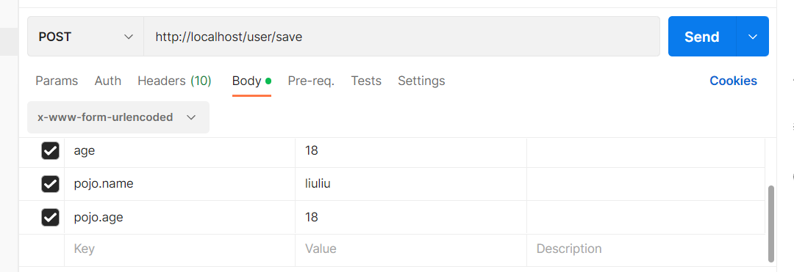

## Spring Framework学习路线

```txt
第一部分：核心容器
	核心概念（IoC/DI）
	容器基本操作
第二部分：整合
	整合数据层MyBatis
第三部分：AOP
	核心概念
	AOP基础操作
	AOP实用开发
第四部分：事务
	事务实用开发
```

# 核心容器

## 一、核心容器简介

核心概念：

IoC：Inversion of Control控制反转，使用对象时，由制动new产生的对象转换为**外部**提供。此过程中对象创建控制权由程序转移到外部，是一中思想。

ioc容器：spring是实现了IoC思想，提供了一个容器，称IoC容器。

DI：依赖注入，在容器中建立bean之间的依赖关系。

### Spring中bean的实例化方式：四种

```xml

    <!--第一种：通过默认空参构造反射创建-->
    <bean id="daoImp" class="com.acai.factory.DaoFactoryBean"/>

    <!--第二种：通过静态工厂创建-->
    <bean id="daoImp2" class="com.acai.factory.DaoFactory" factory-method="getDaoBean"/>

    <!--第三种：通过实例工厂创建-->
    <bean id="daoFactory" class="com.acai.factory.DaoFactory2"/>
    <bean id="daoImp3" factory-bean="daoFactory" factory-method="getDao"/>

    <!--第四种：通过实例工厂创建，优化-->
    <!--实现FactoryBean接口，实现getObject()和getObjectType()方法-->
    <bean id="daoImp4" class="com.acai.factory.DaoFactoryBean"/>
```


### bean的生命周期：两种实现

```xml
     <!--第一种：bean的生命周期，配置实现-->
    <bean id="daoImp5" class="com.acai.dao.DaoImp2" init-method="init" destroy-method="close"/>
	<!--第二种：bean生命周期，实现InitializingBean,和DisposableBean接口-->

    <!--销毁对象-->
    <!--ctx.close() 手工关闭容器-->
    <!--设置关闭钩子,关闭jvm虚拟机之前，关闭容器-->
    <!--ctx.registerShutdownHook();-->
```


- bean在初始化阶段：

  初始化容器：

1. 创建对象（内存分配）
2. 执行构造方法
3. 执行实行注入（set操作）
4. 执行bean初始化方法

使用bean：

1. 执行业务操作

关闭/销毁容器

1. 执行bean销毁

### 依赖注入方式

- 普通方法（set方法）
- 构造方法

依赖注入分类：

- 引用类型
- 简单类型

依赖注入方式：

- setter注入

  1. 简单类型

     ```xml
      <!--依赖注入：setter注入简单类型-->
     <!--类中事先设置setter方法-->
         <bean id="user" class="com.acai.pojo.User">
             <property name="name" value="acai"/>
             <property name="age" value="18"/>
         </bean>
     ```

  2. 引用类型

     ```xml
     <!--依赖注入：setter注入引用类型-->
         <bean id="servicesImp" class="com.acai.services.ServicesImp">
             <property name="dao" ref="daoImp"/>
         </bean>
     ```

- 构造器注入

1. 简答类型

   ```xml
    <!--构造器注入：引用类型-->
       <bean id="services" class="com.acai.services.ServicesImp">
           <constructor-arg name="name" value="acai"/>
           <constructor-arg name="age" value="18"/>
       </bean>
   
   <!--优化-->
    <bean id="services" class="com.acai.services.ServicesImp">
           <constructor-arg  index="0" value="acai"/>
           <constructor-arg  index="1" value="18"/>
       </bean>
   
   ```

2. 引用类型

   ```xml
      <!--构造器注入：引用类型-->
   	<!--事先准备带参构造-->
       <bean id="servicesImp" class="com.acai.services.ServicesImp">
           <constructor-arg name="dao" ref="daoImp"/>
           <constructor-arg name="user" ref="user"/>
       </bean>
   
   <!--优化-->
    <!--构造器注入：引用类型-->
       <bean id="services" class="com.acai.services.ServicesImp">
           <constructor-arg index="0" value="acai"/>
           <constructor-arg index="1" value="18"/>
       </bean>
   ```

   #### 依赖方式的选择：

1. 强制依赖使用构造器注入，使用setter注入有概率导致注入null对象出现
2. 可选依赖使用setter注入进行，灵活
3. Spring框架倡导使用构造器注入，严谨
4. 有必要时同时使用
5. 根据实际项目
6. 自己开发模块推荐setter注入

###  依赖自动装配

概述：IoC容器根据bean所依赖的资源在容器中自动查找并注入到bean中的过程

自动装配的方式：

- 按类型（常用）

  ```xml
   <bean id="servicesImp" class="com.acai.services.ServicesImp" autowire="byType"/>
  ```

- 按名称

- 按构造方法

- 不启用自动装配

依赖自动装配

- 自动装配用于引用类型
- 按类型，相同类型的bean唯一。推荐使用
- 按名称，与变量名耦合，不推荐使用
- 自动装配优先级低于setter与构造器注入，同时出现，自动装配失效

### 集合注入

```xlm
数组 List Set Map Properties
```

### 案例：数据源对象管理

```xml

    <!--管理DruidDataSource-->
    <bean id="druidDataSource" class="com.alibaba.druid.pool.DruidDataSource">
        <property name="driverClassName" value="com.mysql.jdbc.Driver"/>
        <property name="url" value="jdbc:mysql://localhost:3306/spring_db"/>
        <property name="username" value="root"/>
        <property name="password" value="root"/>
    </bean>

    <bean id="c3p0" class="com.mchange.v2.c3p0.ComboPooledDataSource">
        <property name="driverClass" value="com.mysql.jdbc.Driver"/>
        <property name="jdbcUrl" value="jdbc:mysql://localhost:3306/spring_db"/>
        <property name="user" value="root"/>
        <property name="password" value="root"/>
        <property name="maxConnectionAge" value="100"/>
    </bean>
```

### 加载Properties文件

```xml
<!--1.开启context命名空间-->

<?xml version="1.0" encoding="UTF-8"?>
<beans xmlns="http://www.springframework.org/schema/beans"
       xmlns:xsi="http://www.w3.org/2001/XMLSchema-instance"
       xmlns:context="http://www.springframework.org/schema/context"
       xsi:schemaLocation="
       http://www.springframework.org/schema/beans
       http://www.springframework.org/schema/beans/spring-context.xsd

       http://www.springframework.org/schema/context
       http://www.springframework.org/schema/context/spring-context.xsd
">
```

```xml
<!--2.使用context命名空间加载Properties文件-->
<context:property-placeholder location="classpath*:jdbc.properties" system-properties-mode="NEVER"/>
    <bean id="druidDataSource" class="com.alibaba.druid.pool.DruidDataSource">
        <property name="driverClassName" value="${jdbc.driver}"/>
        <property name="url" value="${jdbc.url}"/>
        <property name="username" value="${jdbc.username}"/>
        <property name="password" value="${jdbc.password}"/>
    </bean>
```

### 容器

```
创建容器	获取bean	容器类层次结构	BeanFactory（所有容器类的顶层接口）
```

```java
//1.加载类路径下的配置文件
        ApplicationContext ctx = new ClassPathXmlApplicationContext("applicationContext.xml");

        //2.在文件系统获中取配置文件
        ApplicationContext ctx2 = new FileSystemXmlApplicationContext("C:\\Users\\阿才\\Desktop\\SR\\代码\\spring\\src\\main\\resources\\applicationContext.xml");

        //3.获取bean方式一
        DataSource dataSource = (DataSource) ctx.getBean("c3p0");
        //4.获取bean方式二
        Dao dao = ctx.getBean("dao", Dao.class);
        //5..获取bean方式三
        Dao dao2 = ctx.getBean(Dao.class);
```

### 核心容器总结

- 容器相关

  BeanFactory是IoC容器的顶层接口，初始化BeanFactory对象时，加载bean延迟加载

  ApplicationContext接口是Spring容器的核心接口，初始化时bean立即加载

  ApplicationContext接口提供基础bean操作相关的方法，通过其他接口扩展功能

  ApplicationContext接口常用初始化类

  ​		ClassPathXmlApplicationContext

  ​		FileSystemXmlApplicationContext

- bean相关

- 依赖注入相关

## 二、注解开发

### 注解开发bean

```xml
给bean添加注解
//@Component("dao")
@Controller
@Service
@Repository("dao")

核心配置文件中扫描bean
  <context:component-scan base-package="com.acai"/>
```

### 纯注解开发

```java
Spring3.0开启了纯注解开发，使用java类代替配置文件
自定义一个配置类，给注解
@Configuration	//代替核心配置文件
@ComponentScan({"com.acai.service"，"com.acai.dao"})	//定义扫描器，该注解只能添加一次，多合数据可用数组

//1.加载类路径下的配置类
        AnnotationConfigApplicationContext ctx = new AnnotationConfigApplicationContext(SpringConfig.class);
```

### bean管理

#### 作用范围

```java
@Scope	//单例
@Scope("singleton")	//单例
@Scope("prototype")//非单例
```

#### 生命周期

```java
 @PostConstruct
    public void init() {
        System.out.println("DaoImp#init()");
    }

    @PreDestroy
    public void destroy() {
        System.out.println("DaoImp#destory()");
    }
```

### 自动装配--依赖注入

```java
//使用 @Autowired注解开始自动装配模式（按类型）
@Service
public class ServicesImp implements Services {
    @Autowired
    private Dao dao;
    
    @Override
    public void fun() {
        System.out.println("Services#fun()");
        dao.fun();
    }
}
```

注意：自动装配基于反射设计创建对象并暴力反射对应属性为私有属性初始化方法，因此无需提供setter方法

注意：自动装配建议使用无参构造创建对象（默认），如果不提供对应构造方法，请提供唯一的构造方法

```java
//使用@Qualifile注解开启指定名称装配bean
@Service
public class ServicesImp implements Services {

    @Autowired
    @Qualifier("dao")
    private Dao dao;

    @Override
    public void fun() {
        System.out.println("Services#fun()");
        dao.fun();
    }
}
```

注意：@Qualifile注解无法单独使用，必须配合@Autowired注解使用

```java
//使用@Value实现简单类型注入
public class DaoImp implements Dao {
    @Value("acai")
    private String name;

    @Override
    public void fun() {
        System.out.println("DaoImp#fun()" + name);
    }
}
```

加载外部配置文件

```java
@Configuration
@ComponentScan({"com.acai"})
@PropertySource("classpath:jdbc.properties")
public class SpringConfig {}
```

### 第三方bean管理

#### 第三方的bean管理

```java
public class JDBCConfig {
    @Bean
    public DataSource dataSource() {

        DruidDataSource dataSource = new DruidDataSource();

        dataSource.setDriverClassName("com.mysql.jdbc.Driver");
        return dataSource;
    }
}


@Configuration
@ComponentScan({"com.acai"})
@PropertySource("classpath:jdbc.properties")
@Import(JDBCConfig.class)
public class SpringConfig {}
```

#### 第三方bean依赖注入

```java
//简单类型依赖注入   成员变量
public class JDBCConfig {

    @Value("com.mysql.jdbc.Driver")
    private String DriverClassNam;

    @Bean
    public DataSource dataSource() {
        DruidDataSource dataSource = new DruidDataSource();    dataSource.setDriverClassName(DriverClassNam);
        return dataSource;
    }
}

//引用类型依赖注入  方法形参
public class JDBCConfig {

    @Value("com.mysql.jdbc.Driver")
    private String DriverClassNam;

    @Bean
    public DataSource dataSource(Dao dao) {
        System.out.println(dao);
        DruidDataSource dataSource = new DruidDataSource();
   dataSource.setDriverClassName(DriverClassNam);
        return dataSource;
    }
}
```

### 注解配置与XML配置比较


## 三、Spring整合MyBatis

```xml
<!--导入Maven依赖-->
  <dependency>
            <groupId>org.mybatis</groupId>
            <artifactId>mybatis</artifactId>
            <version>3.5.6</version>
        </dependency>
        <dependency>
            <groupId>org.mybatis</groupId>
            <artifactId>mybatis-spring</artifactId>
            <version>1.3.0</version>
        </dependency>
        <dependency>
            <groupId>org.springframework</groupId>
            <artifactId>spring-jdbc</artifactId>
            <version>5.0.2.RELEASE</version>
    </dependency>
```

jdbc.properties

```properties
url=jdbc:mysql://localhost:3306/acai_db?serverTimezone=UTC
user=root
password=123456
driver=com.mysql.cj.jdbc.Driver
```

JDBCConfig.java

```java
package com.mybatis.config;
import com.alibaba.druid.pool.DruidDataSource;
import org.springframework.beans.factory.annotation.Value;
import org.springframework.context.annotation.Bean;
import javax.sql.DataSource;
public class JDBCConfig {
    @Value("${driver}")
    private String driver;
    @Value("${url}")
    private String url;
    @Value("${user}")
    private String username;
    @Value("${password}")
    private String password;
    @Bean
    public DataSource dataSource() {
        DruidDataSource dataSource = new DruidDataSource();
        dataSource.setDriverClassName(driver);
        dataSource.setUrl(url);
        dataSource.setUsername(username);
        dataSource.setPassword(password);
        return dataSource;
    }
}
```

MybatisConfig.java

```java
package com.mybatis.config;
import org.mybatis.spring.SqlSessionFactoryBean;
import org.mybatis.spring.mapper.MapperScannerConfigurer;
import org.springframework.context.annotation.Bean;
import javax.sql.DataSource;
public class MybatisConfig {
    @Bean
    public SqlSessionFactoryBean sqlSessionFactory(DataSource dataSource) {
        SqlSessionFactoryBean ssfb = new SqlSessionFactoryBean();
        ssfb.setTypeAliasesPackage("com.mybatis.pojo.User");
        ssfb.setDataSource(dataSource);
        return ssfb;
    }
    @Bean
    public MapperScannerConfigurer mapperScannerConfigurer(){
        MapperScannerConfigurer msc = new MapperScannerConfigurer();
        msc.setBasePackage("com.mybatis.dao");
        return msc;
    }
}
```

SpringConfig.java

```java
package com.mybatis.config;
import org.springframework.context.annotation.ComponentScan;
import org.springframework.context.annotation.Configuration;
import org.springframework.context.annotation.Import;
import org.springframework.context.annotation.PropertySource;
@Configuration
@ComponentScan("com.mybatis")
@PropertySource("jdbc.properties")
@Import({JDBCConfig.class,MybatisConfig.class})
public class SpringConfig {
}
```

APP.java

```java
package com.mybatis;
import com.mybatis.config.SpringConfig;
import com.mybatis.pojo.User;
import com.mybatis.service.UserService;
import org.springframework.context.annotation.AnnotationConfigApplicationContext;
import java.util.List;
public class APP {
    public static void main(String[] args) {
        AnnotationConfigApplicationContext context = new AnnotationConfigApplicationContext(SpringConfig.class);
        UserService service = context.getBean(UserService.class);
        List<User> list = service.findAll();
        for (User user : list) {
            System.out.println(user);
        }
    }
}
```


## 四、Spring整合Junit

```xml
<!--导入Maven依赖-->
   <dependency>
            <groupId>junit</groupId>
            <artifactId>junit</artifactId>
            <version>4.12</version>
            <scope>test</scope>
        </dependency>
        <dependency>
            <groupId>org.springframework</groupId>
            <artifactId>spring-test</artifactId>
            <version>5.0.2.RELEASE</version>
        </dependency>
```

```java
@RunWith(SpringJUnit4ClassRunner.class)
@ContextConfiguration(classes = SpringConfig.class)
public class AccountServicesTest {

    @Autowired
    private Services services;

    @Test
    public void servicesTest() {
        services.fun();
    }
}
```

# AOP

## 一、AOP简介

性质：面向切面编程，一种编程范式。

作用：不惊动原始涉及基础上，为其功能增强。

spring理念：无侵入式/无入侵式

**通知/切入点/连接点/切面**

连接点：方法的执行。程序执行过程中的任意位置。粒度为执行性方法，抛出异常，设置变量。

切入点：一个或多个待加强功能的方法的描述

通知：在切入点执行的操作，共性功能

通知类：通知类中可以定义多个共享逻辑（方法）

切面：建立通知和切入点的对应关系


### AOP入门案例

案例：测试接口执行效率

mop.xml

```xml
	   <dependency>
            <groupId>org.aspectj</groupId>
            <artifactId>aspectjweaver</artifactId>
            <version>1.9.4</version>
        </dependency>
```

通用类

```java
package com.spring_aop.aop;

import org.aspectj.lang.annotation.Aspect;
import org.aspectj.lang.annotation.Before;
import org.aspectj.lang.annotation.Pointcut;
import org.springframework.stereotype.Component;

/**
 * DESC 通知类
 *
 * @author YangMingCai
 * @date 2023年02月24日 11:00
 */

@Component
@Aspect
public class MyAdvice {

    @Pointcut("execution(void com.spring_aop.dao.Dao.update())")
    private void pt() {
    }

    @Before("pt()")
    public void addTime() {
        System.out.println(System.currentTimeMillis());
    }
}
```

Spring配置类

```java
package com.spring_aop.config;

import org.springframework.context.annotation.ComponentScan;
import org.springframework.context.annotation.Configuration;
import org.springframework.context.annotation.EnableAspectJAutoProxy;

/**
 * DESC
 *
 * @author YangMingCai
 * @date 2023年02月24日 10:58
 */
@Configuration
@ComponentScan("com.spring_aop")
@EnableAspectJAutoProxy
public class SpringConfig {
}
```

### AOP工作流程

1. Spring容器启动
2. 读取所有切面配置中的切入点
3. 初始化bean，判定bean对应的类中方法是否匹配到任意切入点 
   - 匹配失败，创建对象
   - 匹配成功，创建原始对象（目标对象）的代理对象
4. 获取bean执行方法
   - 获取bean，调用方法并执行，完成操作
   - 获取bean是代理对象时，根据代理对象的运行模式运行原始方法与增强内容，完成操作

#### AOP核心概念

目标对象：原始功能去掉共性功能的类产生的对象，这种对象是无法直接完成最终工作的

代理：目标对象无法直接完成工作，需要对其进行功能回填，通过原始对象的代理对象实现

Spring AOP本质：代理模式

### AOP切入点表达式

切入点：要进行增强的方法

切入点表达式：要进行增强的方法的描述方式

切入点表达式语法格式：动作关键字（访问修饰符 返回值 包.类/接口.方法名（参数）异常名）

```java
@Pointcut("execution(void com.spring_aop.dao.Dao.update())")
```

通配符

```java
@Pointcut("execution(public void com.spring_aop.dao.Dao.update())")
@Pointcut("execution(* void com.spring_aop.dao.Dao.update())")
@Pointcut("execution(* * com.spring_aop.dao.Dao.update())")
@Pointcut("execution(public void com..dao.Dao.update(..))")
```

书写技巧

### AOP通知类型

```java
@Before("pt()")		//前置通知
@After("pt()")		//后置通知
@Around("pt()")		//环绕通知
@AfterReturning("pt()")		//返回值后通知
@AfterThrowing（"pt()"）	  //抛出异常后通知
```

### 案例：测量业务层接口万次执行效率

需求:任意业务层接口执行均可显示其执行效率(执行时长)

分析：

①：业务功能：业务层接口执行前后分别记录时间，求差值得到执行效率

②：通知类型选择前后均可以增强的类型——环绕通知

### AOP总结

- 概念：AOP面向切面编程，一种编程范式
- 作用：在不惊动原始设计的基础上进行功能增强
- 核心概念
  - 代理：SpringAOP的核心本质是采用代理模式实现的；
  - 连接点:在SpringAOP中，理解为任意的方法执行；
  - 切入点:切入点表达式，疲累连接点的式子，也是具有共性功能的方法描述；
  - 通知：若干个方法共性功能，在切入点处执行，最终体现为一个方法；
  - 切面:描述通知与切入点的对应关系；
  - 目标对象:被代理的原始对象称为目标对象；

# Spring事务

### Spring事务简介

事务作用：在数据层保障一系列数据库操作同成功同失败

Spring事务作用：在数据层或**业务层**保障一系列的数据库操作同成败。

```java
//步骤一：在业务层接口上添加Spring事务管理
public interface AccountService {
    @Transactional
    public void transfer(String out, String in, Double money);
}

//步骤二：设置事务管理器
 @Bean
    public PlatformTransactionManager transactionManager(DataSource dataSource) {
        DataSourceTransactionManager ptm = new DataSourceTransactionManager();
        ptm.setDataSource(dataSource);
        return ptm;
    }

//步骤三：开启注解事务驱动
@Configuration
@ComponentScan("com.spring_transaction")
@PropertySource("jdbc.properties")
@Import({JDBCConfig.class, MybatisConfig.class})
@EnableTransactionManagement
public class SpringConfig {}
```

### Spring事务角色

#### 事务管理员

：发起事务方，在Spring中通常指代业务层开启事务的方法

#### 事务协调员

：加入事务方，在Spring中通常指代数据层方法，也可以是业务层方法；

### Spring事务属性

#### 事务配置

#### 案例

#### 事务传播行为

# SpringMVC

## SpringMVC简介

步骤一：依赖导入

```xml
<dependencies>
        <dependency>
            <groupId>org.springframework</groupId>
            <artifactId>spring-webmvc</artifactId>
            <version>5.2.10.RELEASE</version>
        </dependency>
        <dependency>
            <groupId>javax.servlet</groupId>
            <artifactId>javax.servlet-api</artifactId>
            <version>3.1.0</version>
            <scope>provided</scope>
        </dependency>
    </dependencies>
    <build>
        <plugins>
            <plugin>
                <groupId>org.apache.tomcat.maven</groupId>
                <artifactId>tomcat7-maven-plugin</artifactId>
                <version>2.2</version>
                <configuration>
                    <port>80</port>
                    <path>/</path>
                </configuration>
            </plugin>
        </plugins>
    </build>
```

步骤二：创建SpringMVC控制器类（等同于Servlet功能）

```java
@Controller
public class UserController {
    //设置当前操作的访问路径
    @RequestMapping("/save")
    @ResponseBody //设置返回值类型
    public String save() {
        System.out.println("user save ...");
        return "{'module':'springmvc'}";
    }
}
```

步骤三：初始化SpringMVC环境（同Spring环境），设定SpringMVC加载对应的bean

```java
@Configuration
@ComponentScan("com.acai.controller")
public class SpringMvcConfig {
}
```

步骤四：初始化Servlet容器，加载SpringMVC环境，并设置SpringMVC技术的请求

```java
//定义一个servlet容器启动配置类，在里面配置spring的配置
public class ServletContainersInitConfig extends AbstractDispatcherServletInitializer {
    //加载springmvc容器配置
    @Override
    protected WebApplicationContext createServletApplicationContext() {
        AnnotationConfigWebApplicationContext ctx = new AnnotationConfigWebApplicationContext();
        ctx.register(SpringMvcConfig.class);
        return ctx;
    }    //设置那些请求归属springmvc处理
    @Override
    protected String[] getServletMappings() {
        return new String[]{"/"};
    }
    //加载spring容器配置
    @Override
    protected WebApplicationContext createRootApplicationContext() {
        return null;
    }
}
```

### 请求和响应

乱码处理

```java
//乱码处理
    @Override
    protected Filter[] getServletFilters() {
        CharacterEncodingFilter filter = new CharacterEncodingFilter();
        filter.setEncoding("UTF-8");
        return new Filter[]{filter};
    }
```

请求参数与形参名不一致

```java
  //设置当前操作的访问路径
    @RequestMapping("/save")
    @ResponseBody //设置返回值类型
    public String save(@RequestParam("name") String name, @RequestParam("age") int age) {
        System.out.println(name);
        System.out.println(age);
        return "BookController#save()";
    }
```

pojo参数

```java
    //设置当前操作的访问路径
    @RequestMapping("/save")
    @ResponseBody //设置返回值类型
    public String save(User user) {
        System.out.println(user);
        return "UserController#save()";
    }
```

嵌套pojo对象



```java
    //设置当前操作的访问路径
    @RequestMapping("/save")
    @ResponseBody //设置返回值类型
    public String save(User user) {
        System.out.println(user);
        return "UserController#save()";
    }
```

数组保存普通参数

```java
 //设置当前操作的访问路径
    @RequestMapping("/save")
    @ResponseBody //设置返回值类型
    public String save(String[] likes) {
        for (String s : likes) {
            System.out.println(s);
        }
        return "BookController#save()";
    }
```

集合保存普通参数

```java
    //设置当前操作的访问路径
    @RequestMapping("/save")
    @ResponseBody //设置返回值类型
    public String save(@RequestParam List<String> list) {
        for (String s : list) {
            s.length();
        }
        return "BookController#save()";
    }
```

请求参数（json传参）

依赖引入

```xml
<dependency>
            <groupId>com.fasterxml.jackson.core</groupId>
            <artifactId>jackson-databind</artifactId>
            <version>2.9.1</version>
        </dependency>
```

开启自动转换json数据转换支持

```java
@Configuration
@ComponentScan("com.acai.controller")
@EnableWebMvc
public class SpringMvcConfig {}
```

接收json数据

```java
@Controller
@RequestMapping("/json")
public class JsonController {

    @RequestMapping("/save")
    @ResponseBody
    public String save(@RequestBody List<String> likes) {
        for (String like : likes) {
            System.out.println(like);
        }
        return "JsonController@save()";
    }
}
```

日期类型参数传递

```java
 @RequestMapping("date")
    @ResponseBody
    public String dateParam(
            Date date,
            @DateTimeFormat(pattern = "yyyy-MM-dd") Date date1,
            @DateTimeFormat(pattern = "yyyy-MM-dd HH:mm:ss") Date date2) {
        System.out.println(date);
        System.out.println(date1);
        System.out.println(date2);
        return "UserController#dataParam()";
    }
```

